# Proposal: Expanding Catena-X Aspect Models for Cross-Company 3D Engineering Collaboration

Authors: Sarah Berkei, Niklas Fix, Hannes Krug

## Table of Contents

- [Introduction](#introduction)
- [Current state of Catena-X in the context of 3D Data](#current-state-of-catena-x-in-the-context-of-3d-data)
  - [SingleLevelBOM and BOM Concepts](#singlelevelbom-and-bom-concepts)
    - [SingleLevelBOMs in Catena-X](#singlelevelboms-in-catena-x)
    - [BOMs in CAD Methodology](#boms-in-cad-methodology)
  - [Definition of "Part" in Catena-X vs. 3D CAD](#definition-of-part-in-catena-x-vs-3d-cad)
  - [PartAs-X (Planned)](#partas-x-planned)
    - ["Part" in CAD/3D Data (Traditional Definition)](#part-in-cad3d-data-traditional-definition)
    - [Key Differences Between Catena-X "Part" and CAD "Part"](#key-differences-between-catena-x-part-and-cad-part)
  - [Asset Administration Shell](#asset-administration-shell)
    - [Submodels](#submodels)
  - [One-Up-One Down Principle](#one-up-one-down-principle)
- [Separation of 3D Data Responsibilities: Catena-X vs. 3D Data (CAD) Files](#separation-of-3d-data-responsibilities-catena-x-vs-3d-data-cad-files)
  - [On Structure Information & 3D Instances](#on-structure-information--3d-instances)
  - [On Geometry](#on-geometry)
- [New Aspect Models for 3D Data Exchange](#new-aspect-models-for-3d-data-exchange)
  - [3dDataAs-X Aspect Models](#3ddataas-x-aspect-models)
  - [3dModel Aspect Model](#3dmodel-aspect-model)
- [Limitations of current proposal](#limitations-of-current-proposal)
  - [Unclear Linkage to next hierarchies level](#unclear-linkage-to-next-hierarchies-level)
  - [Quantity Mapping of Child Items](#quantity-mapping-of-child-items)
  - [Integration of new Aspect Models with the Asset Administration Shell (AAS)](#integration-of-new-aspect-models-with-the-asset-administration-shell-aas)
  - [Unclear Format of Linked 3dData](#unclear-format-of-linked-3ddata)
- [Discussion on Varying Levels of Detail for Different Participants in the Same Assembly](#discussion-on-varying-levels-of-detail-for-different-participants-in-the-same-assembly)
  - [Case 1: Ownership stays at manufacturer of product (Multi-Up-Multi-Down)](#case-1-ownership-stays-at-manufacturer-of-product-multi-up-multi-down)
  - [Case 2: One-Up-One-Down Contractual Framework](#case-2-one-up-one-down-contractual-framework)
- [Outlook: Current limitations and potential solutions](#outlook-current-limitations-and-potential-solutions)
- [Conclusion](#conclusion)
- [Sources](#sources)
- [Appendix - Example](#appendix---example)
  - [Sample Data](#sample-data)
    - [3D Data Files](#3d-data-files)
    - [Registered Digital Twins of participants](#registered-digital-twins-of-participants)
    - [JSON Files](#json-files)
      - [Exemplary JSON Content](#exemplary-json-content)
        - [3dDataAs-X_P3.json](#3ddataas-x_p3json)
- [Different Cases (1 & 2)](#different-cases-1--2)
  - [Schema Case 1](#schema-case-1)
  - [Schema Case 2](#schema-case-2)

## Introduction

The integration of digital twins and standardized 3D data within collaborative ecosystems is becoming increasingly vital for efficient, secure, and transparent product lifecycle management. In this document, we examine the current state of Catena-X, focusing specifically on its approach to managing and sharing 3D engineering data. The discussion begins by contrasting the Single Level Bills of Materials (BOMs) utilized in Catena-X with the multi-level BOMs typically employed within traditional CAD systems, highlighting critical differences and their implications for industry collaboration.\
We then explore the conceptual distinctions between parts as defined within Catena-X digital twins---emphasizing supply-chain metadata, lifecycle tracking, and semantic interoperability---and parts as represented in CAD environments, which center around geometric and manufacturing information.\
Finally, the document proposes enhancements to the Catena-X model through the introduction of specialized Aspect Models designed explicitly for effective 3D data handling. These additions aim to bridge existing gaps, improve clarity in data representation, and ensure that Catena-X can robustly support complex engineering and manufacturing scenarios across organizational boundaries.

## Current state of Catena-X in the context of 3D Data

This chapter explores **Single Level BOMs in Catena-X**. It contrasts this with **multi-level BOMs in CAD**, which define complete product hierarchies for design and manufacturing. Additionally, it examines how **Catena-X digital twins** differ from CAD parts, the role of the **Asset Administration Shell (AAS)**, and the **One-Up-One-Down Principle** for controlled data sharing.

### SingleLevelBOM and BOM Concepts

#### SingleLevelBOMs in Catena-X

A **Single Level Bill of Materials (BOM)** in Catena-X is a standardized data model that lists the direct components of an assembly -- essentially one level of a product's BOM [[1]][reference-1].

Unlike a multi-level BOM (which includes all nested sub-assemblies), a single-level BOM focuses only on immediate child parts and excludes any lower-level subassemblies [[1]][reference-1]. In practice, a multi-level BOM can be obtained by connecting a series of single-level BOMs across tiers (forming a tree of one-level relationships) [[2]][reference-2]. This approach aligns with how supply chain partners typically share data: each company provides information about the parts it directly uses or produces, without exposing the entire BOM of the end product in one go.

In the Catena-X ecosystem, single-level BOM data is modeled as an **"aspect"** of a part's digital twin. Each part or assembly gets a digital representation (often via an Asset Administration Shell submodel) that includes a SingleLevelBOM aspect describing its immediate components[[3]][reference-3].

For example, an OEM's digital twin of a car door might have a single-level BOM listing the door's direct components (glass, wiring harness, latch, etc.), each identified by standardized part IDs. By design, this one-step-at-a-time representation matches the **one-up/one-down principle** -- companies share part relationship data with their direct suppliers or customers only, which is the basis for secure, sovereign data exchange in Catena-X [[4]][reference-4].

There are four types of Single-Level BOMs, based on the definition aligned with STEP AP 242 along the product lifecycle:

1. **AsDesigned** (not implemented): Build up the initial BoM in design phase of a new automotive product including alternative parts. Expected to have research & development part descriptions instead of specific part numbers

2. **AsPlanned** (implemented): BoM AsPlanned is used to plan manufacturing including alternative parts. It is a generic list of all possible catalogue parts & materials for a specific vehicle project and the supply chain from OEM to raw material suppliers [[5]][reference-5].

3. **AsBuilt** (implemented): BoM as a component is built or manufactured. During manufacturing of e.g. a vehicle the serial numbers & batch numbers are documented. This leads to one BoM per built car. "The BoM includes all part/components which either have a serial number, batch number, JIS number (sequence number) or a combination out of these. This means, that there is a direct and specific connection between a parent and a child part/component so that an accurate and exact traceability is possible." [[6]][reference-6].

4. **AsMaintained** (not implemented): BoM after for e.g. a vehicle was picked up by the customer. Changes to live cycle before may apply due to maintenance or repair work e.g. exchange of parts, liquids, etc. AsMaintained is especially important in the aerospace sector.

#### **BOMs in CAD Methodology**

Comparatively, Bill of Materials (BOMs) should now be considered in the context of CAD engineering. In CAD and, therefore, in 3D data design, these are typically multi-level structures. These structures can be designed according to various functional and procedural requirements. Among others, there are:

- **Engineering BOM (EBOM)**: Focuses on the functional structure from an engineering perspective.

- **Manufacturing BOM (MBOM)**: Focuses on the assembly structure from a manufacturing perspective.

These BOMs can be managed in the 3D Data itself meaning that the structure is persisted within the file. While this can be the case the structure can also be managed in the PLM/PDM system. This is dependent on the respective methodologies on each company and also the use case.

### Definition of "Part" in Catena-X vs. 3D CAD

The following discusses the semantic definition of a part in Catena-X and the traditional CAD context.

**Catena-X Definition of a \"Part\" (Digital Twin Context)**

In the Catena-X ecosystem, a part is represented as a digital twin of an asset -- a standardized digital representation of a physical component. Each part's twin has a globally unique identifier and is registered in a Digital Twin Registry for discovery [[7]][reference-7].

Importantly, Catena-X distinguishes between the physical part and its digital twin: a Unique ID identifies the physical part (especially for serialized items), while a separate AAS ID identifies the twin representing that part. The AAS for a part contains multiple Submodels (aspects), each capturing a different facet of the part's data (e.g. identification, production info, usage history) [[7]][reference-7]. Using these submodels, Catena-X digital twins can reference one another to express assembly relationships (i.e. "part-of" or "consists-of" links in a bill of materials) [[7]][reference-7]. Overall, Catena-X defines a \"part\" in terms of interoperable data -- focusing on its identity, state, and relationships in the supply chain -- rather than just its geometry.

Catena-X differentiates between a **Part Type** and a **Part Instance**.

- **Part Type** is the *design or category* of a part (a generic component definition at the catalog or material level, not tied to a single physical item)[[6]][reference-6].

- **Part Instance** is an actual manufactured item of that design -- e.g. a specific serialized unit, a particular batch, or a JIS delivery unit [[6]][reference-6].

Similar to the usage of the SingleLevelBOMs in the lifecycle stages. A part type typically is referenced already in the early stages such as AsPlanned. While the Part Instance becomes relevant during the later stages e.g. AsBuilt.

Other relevant aspect models might be PartAsSpecified, PartTypeInformation (PartAsPlanned).

This separation allows Catena-X to link many individual part instances to one part type (design), and to track each instance's journey through its lifecycle.

Catena-X further classifies parts by how they are produced and identified, which is crucial for traceability across the supply chain. Key categories include *serialised part*, *batch part, Just-In-Sequence Part*. These are not considered further in the scope of this presentation.

### PartAs-X (Planned)

#### **\"Part\" in CAD/3D Data (Traditional Definition)**

In traditional CAD and 3D modeling, a part refers to a discrete component in a product's design, primarily defined by its geometric model. A CAD part is essentially a 3D object file (or model) that captures the shape, features, and dimensions of a component. While focussed on the geometry the CAD part is "augmented" with information such as: Metadata, PMI, Modelviews, etc.

For example, in mechanical CAD software, a part file contains the solid geometry (often as B-rep or meshes) and maybe some design parameters or material properties needed for engineering. Standards like ISO 10303 (STEP) illustrate the CAD-centric view of a part: STEP's Application Protocol 203 was created to represent the geometry, topology, and configuration of mechanical parts and assemblies for data exchange [[8]][reference-8]. In other words, CAD data focuses on the physical design definition -- the 3D shape, how parts fit together in an assembly, and possibly technical drawings or tolerances (as in CAD models with PMI or GD&T). Each part in CAD typically has a part number or name and can be used in one or many assemblies, but the CAD model itself does not differentiate individual production instances. A CAD "part" is generally a *master design*; if you manufacture 100 identical pieces from that design, they all reference the same CAD file (the CAD model doesn't track each serial number). Assemblies in CAD define structural relationships (which parts connect to which in a product), but these are managed within the CAD/PLM environment and are not inherently meant for cross-company traceability -- they exist to aid design and manufacturing within an organization.

What is included in a CAD file -- and what is not -- is not strictly defined. The actual content varies depending on how the creating company structures its processes, leading to a spectrum of information that may be present.

In summary, a CAD part is geometry-centric, concerned with how the part is shaped and functions in a design, rather than with supply chain metadata.

#### **Key Differences Between Catena-X \"Part\" and CAD \"Part\"**

Therefore, the concept of a part in Catena-X versus in CAD differs in scope and emphasis. Below are a selection of the key differences:

- **Data Focus**: Catena-X parts focus on metadata and lifecycle information (identifiers, production details, usage history) for traceability, without necessarily including geometry. In contrast, CAD parts focus on the geometric representation (3D models, drawings) necessary for production and fabrication.

- **Instance vs. Design**: Catena-X differentiates part instances from part types, with each physical part having its own digital twin and unique ID for item-level traceability. CAD parts, however, represent design templates that can be instantiated multiple times, and do not typically track individual physical instances. It's to be noted that CAD understand variants and configurations that might have an overlap methodologically and semantically but should not be further considered here.

- **Geometric vs. Semantic Content**: Catena-X parts emphasize semantic data through AAS submodels, which include details like serial numbers, batch info, and quality status, focusing on data sharing rather than geometry. CAD parts, on the other hand, contain detailed geometric data (surfaces, solids, dimensions) and "surrounding" data such as structure, PMI, Modelviews, etc. essential for manufacturing and simulation.

- **Lifecycle and Supply Chain Information**: Catena-X parts track the full lifecycle of a part, including manufacturing, maintenance, and end-of-life data, shared across organizations with data sovereignty. CAD models, however, are primarily created during design and do not include in-service data, as this is managed by other systems (PLM, ERP, MES).

- **Use Case Emphasis**: Catena-X parts support use cases like supply chain traceability, regulatory compliance, and digital product passports by linking parts to manufacturing and sourcing details. In contrast, CAD parts are used in engineering and manufacturing for design iteration, simulation, and CNC programming but do not provide traceability or detailed product history

### Asset Administration Shell

"The **Asset Administration Shell (AAS)** is a key concept of Industry 4.0 (or \"Industrie 4.0\" in German), maintained by the Industrial Digital Twin Association (IDTA), and is used to describe an asset electronically in a standardized manner. The AAS is a standardized way to implement a Digital Twin."

- **Submodels:** The AAS is based on the concept of submodels, which describe different aspects of an asset for various use cases and data consumers (see Submodels).

- **APIs:** The AAS specification provides standardized API methods and resources for accessing the data of a digital twin.

- **Semantic Description:** In Catena-X, the semantics of a submodel are defined through an aspect model that follows the **CX-0003** standard, preferably with properties conforming to **CX-0044**.

#### Submodels

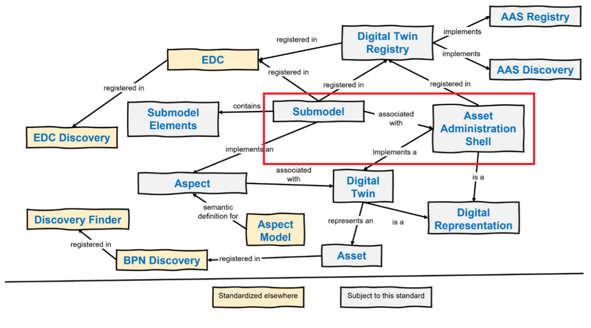
*Overview of submodels as found on [[7]][reference-7]*

A submodel is a **modular part of the AAS** that contains specific information about an asset. Each submodel represents a defined subset of data and functions within the digital twin. It describes:

- **The submodel ID**

- **The semantic ID**: Which semantic model the submodel represents for the asset

- **Endpoints**: Where and under which protocol the submodel can be accessed

- **Interface**: Defines the interface ensuring that exchanged data complies with the referenced aspect model\'s specification through a defined interface

### One-Up-One Down Principle

Another important aspect when working Catena-X is the One-Level-Up / One-Level-Down Principle. Meaning that data is always shared between participant one level up or down in the supply chain. Therefore, also the data provisioning and authorization is typically represented in contracts between one-level-up/down participants.

## Separation of 3D Data Responsibilities: Catena-X vs. 3D Data (CAD) Files

Before proposing new aspect models for Catena-X we want to discuss on the separation of "responsibilities" of transporting 3d data information. The following chapters discusses typical contents and the focus of catena-x vs. 3D Data / CAD Files.

When augmenting Catena-X with capabilities to exchange and describe 3D data the information contained can be divided into at least 4 categories (not extensive):

- **Structure Information**: The hierarchical organization of a 3D model, defining assemblies, parts, and their relationships to provide context and dependencies within the dataset.

- **Geometry**: The mathematical representation of the shape and form of a 3D object, including surfaces, edges, and volumes, typically stored as meshes, B-Rep, or point clouds.

- **Metadata**: Descriptive and technical information attached to a 3D model, such as material properties, manufacturing data, versioning, and lifecycle status, enabling better data management and interoperability.

- **PMI (Product and Manufacturing Information)**: Annotations, dimensions, tolerances, and other manufacturing-related data embedded in a 3D model to communicate design intent without the need for 2D drawings.

- **Modelviews**: Defined perspectives or filtered representations of a 3D model, allowing users to focus on specific aspects, such as a particular component, assembly state, or a step in a review process.

*For this iteration we shall focus on Structure and Geometry Information.*

### On Structure Information & 3D Instances

The structure of 3D CAD models typically consists of assemblies, sub-assemblies, components, parts, and bodies.

An **assembly** is a combination of multiple **parts**. Each **part**, in an engineering context, represents a self-contained geometry. Parts can be modeled using various approaches, including volume-based, feature-based, sketch-based methods, or a combination of these techniques. Therefore, they are defined by bodies, sketches and features.

When creating an assembly, individual parts are instantiated within the context of other parts. This instantiation process involves positioning each part, commonly using relational constraints such as surface-to-surface or axis alignment. Each instantiation defines a transformation for the respective part. As a result, when an assembly is loaded, each part's spatial position is already established.

**CAD Structure Example:**

- Assembly
  - Sub-Assembly
    - Part
    - Part
    - ...
  - Part
  - ...

In the context of exchanging 3D data via Catena-X, the concept of instantiation is particularly significant. Here, we differentiate between \"3D data\" and a \"3D asset.\" A **3D asset** refers explicitly to a structured product description containing all essential information about the product, with the asset serving as the root node of this structured description.

When participants exchange 3D assets within Catena-X, each asset serves as an entry point to the participant\'s detailed \"3D product description.\" By combining multiple 3D assets from different participants throughout the supply chain or development cycle, a new hierarchical structure emerges. We currently refer to this as the **product structure**. This structure aggregates multiple 3D assets contributed by Catena-X participants.

For example, consider Participant 1 purchasing a product from Participant 2 and integrating it into their own product. At the moment of integration, Participant 1 instantiates the 3D asset provided by Participant 2, creating a structure conceptually analogous to traditional CAD modeling but with a different semantic meaning:

**Structure in Catena-X:**

- Product 1 (provided by Participant 1)
  - SubPart
    - 3D Data Asset
      - Assembly (as described in asset file)
        - Sub-Assembly
          - Part
          - ...
  - SubPart (e.g. Product 2)
    - 3D Data Asset
      - Assembly (as described in asset file)
        - Sub-Assembly
          - Part
          - ...
- Product 2 (provided by Participant 2)
  - 3D Data Asset
    - Assembly (as described in asset file)
      - Sub-Assembly
        - Part
        - ...

### On Geometry

Geometry can be defined as the area of mathematics relating to the study of space and the relationships between points, edges, faces and shapes. Whereas:

- Points: Zero-Dimensional entities defined by a single coordinate

- Edges (Lines, Curves): One-Dimensional entities connecting two points

- Faces: Two-Dimensional surfaces bounded by edges

- Shapes: Three-dimensional entities composed of multiple faces

This information is persisted in 3d data assets. When introducing geometric information exchange within Catena-X this might be a potential to directly exchange pieces of information on the level of geometric information.

For this iteration we choose to keep the exchange of this type of information contained in the 3d data. In the future it might be suitable to have the discussion on a deeper level according to the above definition.

## New Aspect Models for 3D Data Exchange

In the current structure of Catena-X, 3D data cannot be adequately represented. To address this limitation, we propose extending Catena-X with two additional Aspect Models:

- **3dDataAs-X** (3dDataAsDesigned, 3dDataAsPlanned, 3dDataAsBuilt, 3dDataAsMaintained)

- **3dModel**

In the following we will refer to the 4 lifecycle aspect models as **3dDataAs-X**.

The **3dDataAs-X aspect** model should represent the 3D model structure in the sense of a product in catena-x by linking to child components and optional their associated transformations, ensuring a clear hierarchical and spatial relationship between elements. Additionally, the aspect model is referencing to the 3dModel data, without distinguishing in the representation whether it its own data or data from other suppliers. The **3dModel** aspect, provides access to the relevant 3D data by a reference to their storage location (URN, URI, URL, external file location), enabling efficient retrieval and visualization of detailed design information. These extensions would enhance the digital representation of product structures within Catena-X and support seamless integration across the value chain.

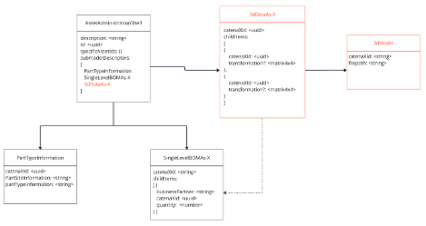
*Catena-X augmented with new 3D Aspect Models*

### 3dDataAs-X Aspect Models

The **3dDataAs-X** aspect model has its own unique catenaXId and contains a list of childItem*s*. Each childItem includes a catenaXId, which refers either to the subsequent Asset Administration Shell (AAS) representing the next 3D data entry or the own contributed 3dModel directly. The structure is similar to the SingleLevelBOMAs-X hierarchy connecting the 3D data of digital twins in the supply chain by listing the childItems in a hierarchical form. If further hierarchical elements exist, they are linked via the AAS, whereas if a child's 3D data is directly provided, it is referenced via the 3dModel Aspect. Therefore, a 3dDataAs-X, in contrast to a SingleLevelBOMAs-X, can exist even when there are no more hierarchical children, but if the digital twin provides its own 3dModel, these are linked to it.

Furthermore, an optional transformation is included, defining how the 3D geometry of the childItem is positioned within the parent 3D coordinate system.

The following describes a 3dDataAs-X-Aspect Model. The other lifecycle stages can be seen similar.

```
:3dDataAs-X a samm:Aspect;
   samm:preferredName "3D Data as X"@en;
   samm:description "Represents a 3D data components in a certain life cycle (As-X), including their transformations, as assembled at a single structural level. Each child item includes a unique identifier and its transformation data."@en;
   samm:properties (:catenaXId :childItems);
   samm:operations ();
   samm:events ().
   
:catenaXId a samm:Property;
   samm:preferredName "Catena-X Identifier"@en;
   samm:description "The Catena-X ID of the given part (e.g., the component), valid for the Catena-X dataspace."@en;
   samm:characteristic ext-uuid:UuidV4Trait;
   samm:exampleValue "urn:uuid:055c1128-0375-47c8-98de-7cf802c3241d".

:childItems a samm:Property;
   samm:preferredName "Child Items"@en;
   samm:description "Set of child items representing 3D components and their transformations, assembled into the given parent object (one structural level down)."@en;
   samm:characteristic :SetOf3DChildItemsCharacteristic.

:SetOfChildItemsCharacteristic a samm-c:Set;
   samm:preferredName "Set of 3D Child Items"@en;
   samm:description "Set of child items, each defined by a Catena-X ID and associated 3D transformation data."@en;
   samm:dataType :ChildData.

:ChildData a samm:Entity;
   samm:preferredName "Child 3D Data"@en;
   samm:description "Contains the Catena-X ID and transformation data for each assembled child item."@en;
   samm:properties (:catenaXId :transformation).

:transformation a samm:Property;
   samm:preferredName "Transformation"@en;
   samm:description "The positional, rotational, and scaling transformation of the child item relative to its parent."@en;
   samm:characteristic :TransformationCharacteristic.

:TransformationCharacteristic a samm:Characteristic;
   samm:preferredName "Transformation Matrix Characteristic"@en;
   samm:description "A 4x4 transformation matrix representing position, rotation, and scaling."@en;
   samm:dataType xsd:string;
   samm:exampleValue "[1,0,0,0, 0,1,0,0, 0,0,1,0, 0,0,0,1]".
```

### 3dModel Aspect Model

The **3dModel** aspect model is responsible for the direct referencing of the 3D data. Each 3D data must be integrated in a 3dModel, which can then be linked in the 3dDataAs-X via the child items. The 3dModel introduces a catenaXId and a filepath, which contains an external reference to the 3D data location. This allows the data to be provided independently of the 3D data type.

```
:3dModel a samm:Aspect;
   samm:preferredName "3D Data as Planned"@en;
   samm:description "Represents a structured entity that directly references 3D data. Each 3DModel acts as a container for a specific 3D representation and is required for integrating 3D data into the system."@en;
   samm:properties (:catenaXId :childItems);
   samm:operations ();
   samm:events ().
   
:catenaXId a samm:Property;
   samm:preferredName "Catena-X Identifier"@en;
   samm:description "The Catena-X ID of the given part (e.g., the component), valid for the Catena-X dataspace."@en;
   samm:characteristic ext-uuid:UuidV4Trait;
   samm:exampleValue "urn:uuid:055c1128-0375-47c8-98de-7cf802c3241d".

:filepath a samm:Property;
   samm:preferredName "External file path"@en;
   samm:description "Refers to the location where the 3D data is stored."@en;
   samm:characteristic :FilepathCharacteristic.
   
:FilepathCharacteristic a samm:Characteristic;
   samm:preferredName "Filepath Characteristic"@en;
   samm:description "The urn of the external file storage location."@en;
   samm:dataType xsd:string;
   samm:exampleValue "urn:uuid-path-to-file".
```

## Limitations of current proposal

The current proposal holds some limitation that we want to discuss here.

### Unclear Linkage to next hierarchies level

Currently, the linkage from the catenaXId of a childItem within the 3dDataAs-X to the next hierarchical level is ambiguous. Specifically, it is unclear whether the catenaXId references directly to a 3dModel or to an Asset Administration Shell (AAS). Due to simplification efforts and considerations regarding access rights, visibility rules, and edge case handling, the current proposal deliberately avoids differentiating between internal and external references, relying solely on a single catenaXId.\
However, this approach introduces limitations in clarity and explicit linkage. An alternative solution could involve distinguishing between two identifiers: an externalCatenaXId and an internalCatenaXId. The externalCatenaXId would explicitly link to an AAS providing e.g. a reduced data form of the 3dModel, ensuring availability even without direct connectivity between participants (aligned with the One Up One Down Principle). Conversely, the internalCatenaXId could directly reference either the complete 3dModel (if the data is directly accessible through the Digital Twin) or an AAS offering full data access. Although more complex, implementing this distinction would resolve the ambiguity and clearly define different access scenarios, enhancing robustness in hierarchical data referencing.

### Quantity Mapping of Child Items

The quantity for each childItem is specified as a number in the SingleLeveleBOMAs-X. Assuming that the SingleLevelBOMAs-X and 3dDataAs-X structures have a semantically similar meaning: If there is a corresponding entry in the 3dDataAs-X, it must be appeared in the same quantity, meaning the mapping quantity \> 1 in the SingleLevelBOMAs-X must be handled.

Possible Solutions:

1. **Include Quantity in childItems** -- Add a quantity attribute to childItems and allow multiple transformations or a list of transformations per childItem. However, this approach results in redundant quantity information, which can lead to inconsistencies if the quantity values are not kept in sync.

2. **Replicate childItems Based on Quantity** -- Create as many childItems as specified in the quantity attribute of the SingleLevelBOM. This means the same childCatenaXId from the SingleLevelBOM would appear multiple times in CADAsPlanned. As a result, instead of searching for a single childItem, it would be necessary to handle a list of childItems and cluster them by childCatenaXId during runtime. However, this approach carries the risk that the number of childItems does not always correctly reflect the specified quantity, potentially leading to mismatches between the BOM and the actual structure in CADAsPlanned.

### Integration of new Aspect Models with the Asset Administration Shell (AAS)

The **3dDataAs-X** aspect model integrates seamlessly with the Asset Administration Shell (AAS) to enable a structured and hierarchical representation of 3D data across different suppliers and systems.

1. Hierarchical Linking via AAS

    - Each CADasPlanned instance is represented as an AAS submodel, identified by a unique CatenaXID.

    - If a childItem references another 3D model provided by a different supplier or system, it links to the next AAS instance via its childCatenaXID.

    - This approach ensures that complex product structures, involving multiple suppliers, can be managed in a distributed and modular fashion.

2. Direct 3D Data Integration

    - If a childItem contains its own 3D data instead of referencing another AAS, it includes a link to the 3dModel using the catenaXId.

    - This allows seamless access to supplier-provided or internally generated 3D assets.

The 3dModel Aspect Model can be linked via the 3dDataAs-X.

### Unclear Format of Linked 3dData

Currently, the 3dModel lacks explicit information about the format of the linked 3dData. This absence could present limitations in data interoperability and accessibility.

## Discussion on Varying Levels of Detail for Different Participants in the Same Assembly

Catena-X aims to enable collaboration through decentralized data management and operations. However, when dealing with 3D data, **intellectual property (IP) protection** can become a critical challenge. The creation of multi-level structure of product in Catena-X poses the question on how to handle different "reduced" versions of the 3D Data as different participants might reference the same digital twin but will have different access rights to 3dModels.

This is demonstrated in the example where participant 1 has a contractual frame with participant 3 but not with participant 5. Participant 3 non-the-less assembles their product with parts purchased at participant 5. Here we run into a conflict between the two principles:

- One-Up-One-Down

- Data ownership

This creates two cases on how to handle such a situation:

- Case 1: Data ownership is preferred

- Case 2: One-Up-One-Down is preferred

### Case 1: Ownership stays at manufacturer of product (Multi-Up-Multi-Down)

Assuming that the 3dData ownership should stay as close as possible to the participant actually designing it could mean that the responsibility of this participant changes. Instead of only providing data to one contractual partner the participant is now responsible to provided data for all participants along the supply chain. This would create a multi-up-multi-down principle of all participants.

Participant 5 would then provide two "digital twins" with 3dData aspect models (as shown in example case 1). One with the "full" information and one with "reduced". This is shown with the lid of the tank.

Participant 1 would have access to the "reduced" digital twin.

Participant 3 would have access to the "full" digital twin.

### Case 2: One-Up-One-Down Contractual Framework

Assuming a preference to maintain the one-up-one-down principle the registering of digital twins & the data ownership would change.

Since participant 3 needs to provide 3dData to participant 1 he needs to get a model he is allowed to share from participant 5. Participant 5 would provide this "reduced" model to participant 3. Participant 3 is now managing this file set within his own system and therefore owns it.

The product / digital twin registered by participant 3 would then link both aspect models within 3dDataAs-X. One link to the owned reduced 3dModel and one link to the full 3dModel managed by participant 5 (linked via SingleLevelBOM(P3) → AAS(P5) → 3dDataAs-X(P5) → 3dModel(P5))

## Outlook: Current limitations and potential solutions

The current proposal presents several challenges related to the handling of quantities, data ownership, authorization, and data redundancy in the context of the SingleLevelBOMAs-X and new 3dDataAs-X aspect model.

1. **Quantity Mapping and Validation**:

    A key limitation lies in the mapping of quantities of a childItem between the SingleLevelBOMAs-X and the corresponding childItem in the 3dDataAs-X. Several approaches can be considered to address this challenge:

    - **Including Quantity in childItems**:

      By adding a quantity attribute to the childItems in the 3dDataAs-X, it would allow multiple transformations or a list of transformations per childItem. However, this could lead to redundancy and potential synchronization issues, as the quantity values need to be consistently kept in sync between the SingleLevelBOMAs-X and the 3dDataAs-X.

    - **Replicating childItems Based on Quantity**:

      Another option is to create multiple childItems in the 3dDataAs-X for each quantity value specified in the SingleLevelBOMAs-X. This would make it necessary to cluster and manage these items effectively during runtime, ensuring that each occurrence of the childItem corresponds to the correct quantity. However, this approach may introduce risks related to mismatches between the SingleLevelBOMAs-X and the actual assembly structure, as the quantity values may not always correctly reflect the number of items in the assembly or 3D model.

2. **Ownership and Authorization:**

    Another critical limitation is related to data ownership and access rights. The current approach does not clearly define how data is owned, who provides it, and how access is granted, particularly when there is no direct connection or contract between participants. Future solutions could reintroduce the internal/external distinction discussed above or find other ways to manage access rights and data visibility, especially given the varying roles and access needs of participants.

3. **Data Redundancy and Intellectual Property (IP) Handling**:

    The handling of data redundancy is another challenge. Data may be provided in reduced form (for restricted access) or in detailed form (for full access), which can create complexity in managing different levels of data access. Additionally, data can be provided by different suppliers to ensure full access when needed. Solutions could involve more robust mechanisms for handling data access at different levels, ensuring that only the required level of data is available to specific users while preventing unauthorized access.

4. **Format of Linked 3dData:**

    Future iterations might consider including explicit format specifications to enhance clarity and ensure consistent usage and integration across different systems.

    The current proposal faces several critical challenges, notably in quantity management, data ownership, authorization, and data redundancy. Addressing these challenges opens opportunities for future projects, such as developing robust quantity synchronization mechanisms between SingleLevelBOMAs-X and 3dDataAs-X, clearly defining data ownership and access authorization models, and establishing comprehensive intellectual property management approaches. Additionally, enhancing the specificity of 3dData format information could significantly improve interoperability across systems. Tackling these challenges through iterative development and targeted solutions could substantially enhance the clarity, robustness, and practical utility of the overall proposal.

## Conclusion

The integration of 3D engineering data into Catena-X through the proposed expansion of Aspect Models represents a significant step toward enabling seamless cross-company 3D collaboration. By introducing new 3D-specific Aspect Models, such as 3dDataAs-X and 3dModel, this proposal addresses the limitations of current implementations, which primarily focus on describing structural data and exchanging 3D data with Catena-X. These new models will enhance interoperability, ensure traceability, and provide a robust framework for managing hierarchical and geometric data across the supply chain.

The proposed approach leverages the existing Catena-X infrastructure, including the Asset Administration Shell (AAS) and the One-Up-One-Down Principle, while introducing flexibility to accommodate contractual frameworks and varying levels of data access. By aligning 3D data exchange with Catena-X\'s principles of data sovereignty and secure collaboration, this proposal ensures that intellectual property is protected while enabling efficient data sharing.

Despite the challenges related to quantity mapping, data ownership, and redundancy, the outlined solutions provide a clear path forward. The integration of 3D data into Catena-X will not only enhance digital twin representations but also foster innovation and efficiency in engineering collaboration across industries. This proposal sets the foundation for a future where 3D data becomes a core component of the Catena-X ecosystem, driving digital transformation and enabling new use cases in the supply chain and beyond.

## Sources

[reference-1]: https://eclipse-tractusx.github.io/docs-kits/kits/Industry%20Core%20Kit/Business%20View%20Industry%20Core%20Kit/#:~:text=A%20single,level%20subassemblies
[reference-2]: https://eclipse-tractusx.github.io/docs-kits/kits/Industry%20Core%20Kit/Business%20View%20Industry%20Core%20Kit/#:~:text=blend%2C%20intermediate%2C%20etc,individual%20single%20level%20BOMs%20together
[reference-3]: https://catena-x.net/fileadmin/user_upload/Standard-Bibliothek/Update_PDF_Maerz/PLM_Quality_Use_Case_Traceability/CX_-_0042_Semantic_Model_Single_Level_BomAsPlanned_v_1.0.1.pdf#:~:text=The%20semantic%20model%20described%20below,BOM%E2%80%9D
[reference-4]: https://eclipse-tractusx.github.io/docs-kits/kits/Industry%20Core%20Kit/Business%20View%20Industry%20Core%20Kit/#:~:text=to%20their%20sub,and%20data%20sovereign%20data%20chain
[reference-5]: https://catenax-ev.github.io/docs/next/standards/CX-0126-IndustryCorePartType
[reference-6]: https://catenax-ev.github.io/docs/next/standards/CX-0127-IndustryCorePartInstance
[reference-7]: https://catenax-ev.github.io/docs/next/standards/CX-0002-DigitalTwinsInCatenaX
[reference-8]: https://www.precisionmoldedplastics.com/blog/cad-part-modeling/#:~:text=ISO%2010303%20includes%20numerous%20Application,Additionally

## Appendix - Example

In the following, an example use case is constructed that represents a typical application of 3D data in the Catena-X context. It consists of 5 exemplary participants in the supply chain (Participant 1-5). Participant 1 simulates an OEM while the participants 2, 3 and 4 simulate a first-level tier. Participant 5 can be seen as a second-level tier (via participant 3, in our case). The product published by participant 1 is a full motorbike assembly (asm_motorbike_full). This product is a combination of parts and assemblies described in the STEP files **and** products published via Catena-X typically in a JSON file.

The project with code, sample files etc. can be found under: <https://github.com/threedy-io/catena-x-3d>

### Sample Data

#### 3D Data Files

We have the following sample 3D data files that represent the data *created, published and owned* by one of the 5 participants.

For the scope of this project the Datapool typically in the form of a PLM, PDM or other data management system is "simulated" via simple Server. All STEP File can be found under: <https://data-public.threedy.io/testdata/catena-x/Proposal1_Example/>. The links to each file can be seen as the "endpoint" provided by each participant to consume the 3D data asset.

| Name of owned file | Visual of owned data                        | Owned by participant | Notes                                                                              |
|--------------------|---------------------------------------------|----------------------|------------------------------------------------------------------------------------|
| asm_frame          | 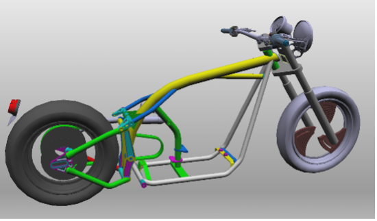        | 1                    |                                                                                    |
| asm_drive          | 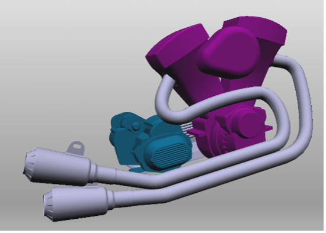        | 2                    |                                                                                    |
| sheet_tank         | 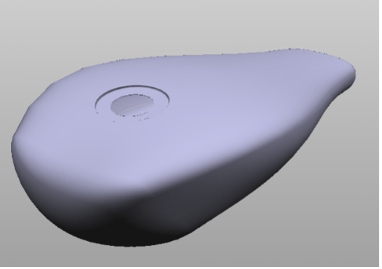      | 3                    |                                                                                    |
| lid_reduced        | 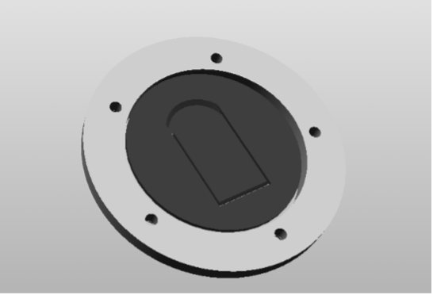    | 3                    | reduced in structure "baking" subassemblies into one structural node and geometry  |
| breakdisc          |         | 4                    |                                                                                    |
| asm_lid_full       |   | 5                    |                                                                                    |

#### Registered Digital Twins of participants

| Name of owned Digital Twin | Visual of owned data            | Published by participant | Notes                                                                     |
|----------------------------|---------------------------------|--------------------------|---------------------------------------------------------------------------|
| AAS_P1.json                | 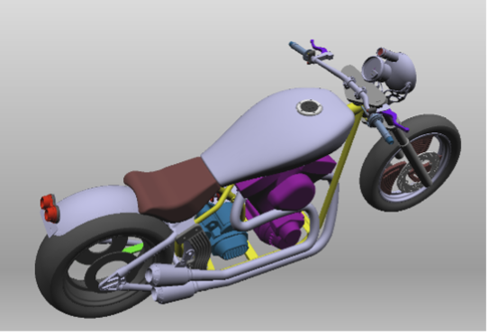  | 1                        | Including sub-parts and sub-assemblies from participants 1, 2, 3, 4 & 5.  |
| AAS_P2.json                | 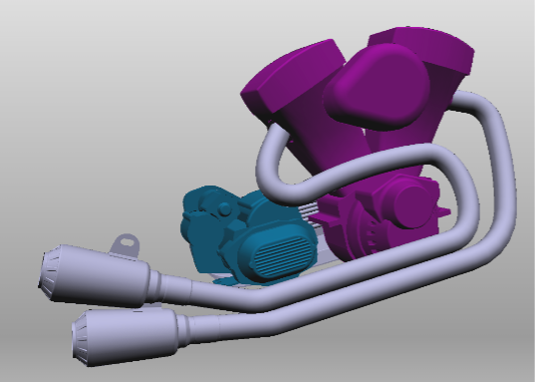  | 2                        |                                                                           |
| AAS_P3.json                | 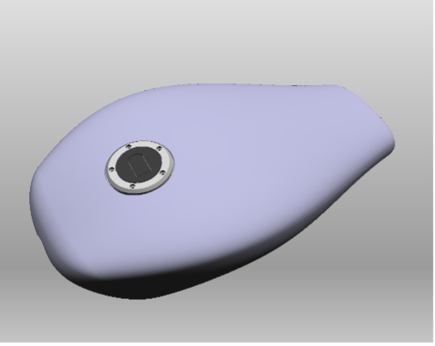  | 3                        | Including sub-parts and sub-assemblies from participants 3 & 5.           |
| AAS_P4.json                | 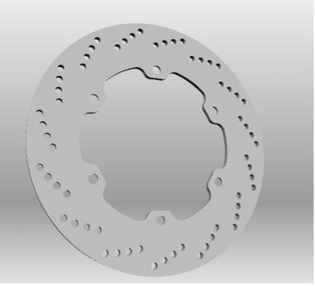  | 4                        |                                                                           |
| AAS_P5.json                | 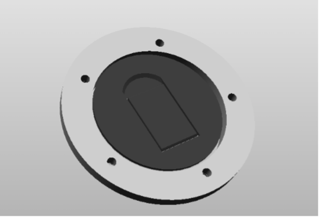  | 5                        |                                                                           |

#### JSON Files

| Participant   | Asset Administration Shell | PartTypeInformation         | SingleLevelBOMAs-X | 3dDataAs-X         | 3dModelAs-X                                            |
|---------------|----------------------------|-----------------------------|--------------------|--------------------|--------------------------------------------------------|
| Participant 1 | AAS_P1.json                | PartTypeInformation_P1.json | SLBOM_P1.json      | 3dDataAs-X_P1.json | 3dModel_asm_frame.json                                 |
| Participant 2 | AAS_P2.json                | PartTypeInformation_P2.json | -- (Leaf)          | 3dDataAs-X_P2.json | 3dModel_asm_drive.json                                 |
| Participant 3 | AAS_P3.json                | PartTypeInformation_P3.json | SLBOM_P3.json      | 3dDataAs-X_P3.json | 3dModel_sheet_tank.json<br/>3dModel_lid_reduced.json   |
| Participant 4 | AAS_P4.json                | PartTypeInformation_P4.json | -- (Leaf)          | 3dDataAs-X_P4.json | 3dModel_breakdisc,json                                 |
| Participant 5 | AAS_P5.json                | PartTypeInformation_P5.json | -- (Leaf)          | 3dDataAs-X_P5.json | 3dModel_asm_lid_full.json<br/>3dModel_lid_reduced.json |

##### Exemplary JSON Content

###### 3dDataAs-X_P3.json

```json
{
  "catenaXId": "3dDataAs-X_P3",
  "childItems": [
    {
      "catenaXId": "3dModel_sheet_tank",
      "transformation": [
        0.9202475547790527, 0, -0.3913368284702301, 0, 
        0, 1, 0, 0,
        0.3913368284702301, 0, 0.9202475547790527, 0,
        0.7266845703125, 0, 0.45476603507995605, 1
      ]
    },
    {
      "catenaXId": "AAS_P5",
      "transformation": [
        0.9965351223945618, 3.789290270450607e-10, -0.08317291736602783, 0,
        0.08264360576868057, 0.11263901740312576, 0.9901933073997498, 0,
        0.009368516504764557, -0.9936360120773315, 0.1122487485408783, 0,
        0.7398085594177246, -0.009829739108681679, 0.5797745585441589, 1
      ]
    },
    {
      "catenaXId": "3dModel_lid_reduced",
      "transformation": [
        0.9965351223945618, 3.789290270450607e-10, -0.08317291736602783, 0,
        0.08264360576868057, 0.11263901740312576, 0.9901933073997498, 0,
        0.009368516504764557, -0.9936360120773315, 0.1122487485408783, 0,
        0.7398085594177246, -0.009829739108681679, 0.5797745585441589, 1
      ]
    }
  ]
}
```

###### 3dModel_asm_lid_full.json

```json
{
  "catenaXId": "3dModel_asm_lid_full",
  "file": "<path-to-data>/CatenaX/example/asm_lid_full.step"
}
```

###### 3dModel_lid_reduced.json

```json
{
  "catenaXId": "3dModel_lid_reduced",
  "file": "<path-to-data>/CatenaX/example/lid_reduced.step"
}
```

## Different Cases (1 & 2)

In the following, we draw schemas for two cases of modelling the integration of our newly proposed Catena-X aspect models "3dDataAs-X" and "3dModel". Both cases focus on how 3D assets can be accessed from an indirect tier, thus showing only the relation of participant 1 (P1, OEM), participant 3 (P3, Tier 1) and participant 5 (P5, Tier 2).

### Schema Case 1

Please see diagram [here](../media/catena-x-case-version-1.jpg)

### Schema Case 2

Please see diagram [here](../media/catena-x-case-version-2.jpg)
